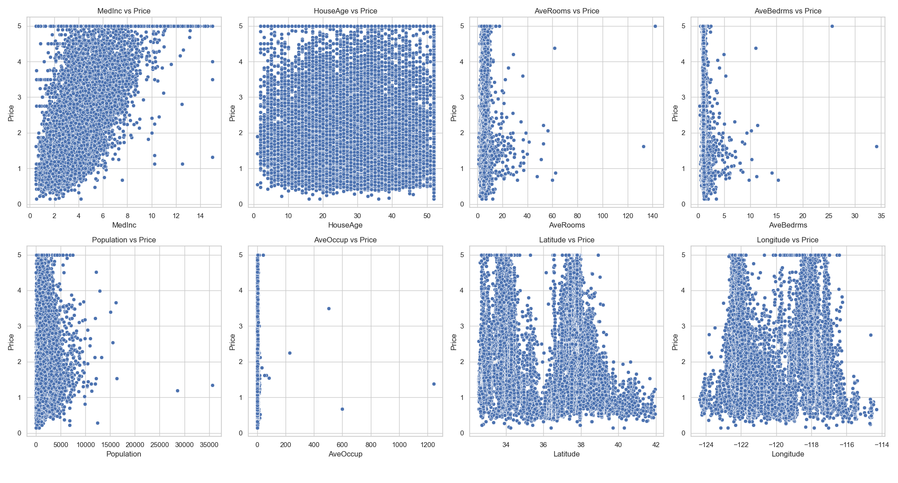

# California Housing Price Prediction

The goal of this project is to explore the California housing dataset and understand the relationship between various features (such as location, population, income levels, etc.) and house prices. Using visualizations and data analysis techniques, we aim to explore key patterns in the data that can help in predicting house prices.

## Dataset
The dataset is taken from the `California Housing Dataset`, which contains various features for each block in California, such as:
- longitude, latitude
- housingMedianAge
- totalRooms, totalBedrooms
- population, households
- medianIncome, medianHouseValue
- oceanProximity (the distance of the house from the ocean)

## Project Steps

### 1. Data Loading and Exploration
- The dataset is loaded using `fetch_california_housing` from `sklearn.datasets`.
- Data is converted into a Pandas DataFrame for easier manipulation.
- Features are labeled appropriately, and the target variable (house prices) is added to the dataset.

### 2. Data Preprocessing
- Data is checked for missing values and outliers.
- Features are examined for their relationship with house prices.

### 3. Data Visualization
Various plots are created to understand the relationships between features and house prices:
- **Scatter Plots**: To show individual feature vs. price relationships.
- **Correlation Heatmap**: To identify correlations between features and prices.

#### Example Visualization - Correlation Heatmap
The correlation heatmap shows the relationships between different features and their correlation with house prices.

#### Example Visualization - Housing Features vs. Price
This scatter plot shows the relationship between various features and the price of houses.

### 4. Modeling (Optional)
- After visualizing the data, machine learning models such as linear regression or decision trees could be applied to predict house prices.
- The goal is to build a model that accurately predicts housing prices based on the available features.

## Kaggle Notebook
You can access the full project notebook on Kaggle to explore and run the code:

[Kaggle Notebook - California Housing Price Prediction](https://www.kaggle.com/code/phenomsg/california-housing-price-prediction)

## Kaggle Profile
For more projects and insights, you can visit my Kaggle profile:

[Kaggle Profile - PhenomSG](https://www.kaggle.com/phenomsg)

## Tools and Libraries Used
- **Python**: Programming language used for data manipulation and visualization.
- **Pandas**: Data manipulation and analysis.
- **Matplotlib & Seaborn**: For creating data visualizations.
- **Scikit-learn**: For loading the dataset and implementing machine learning models.
